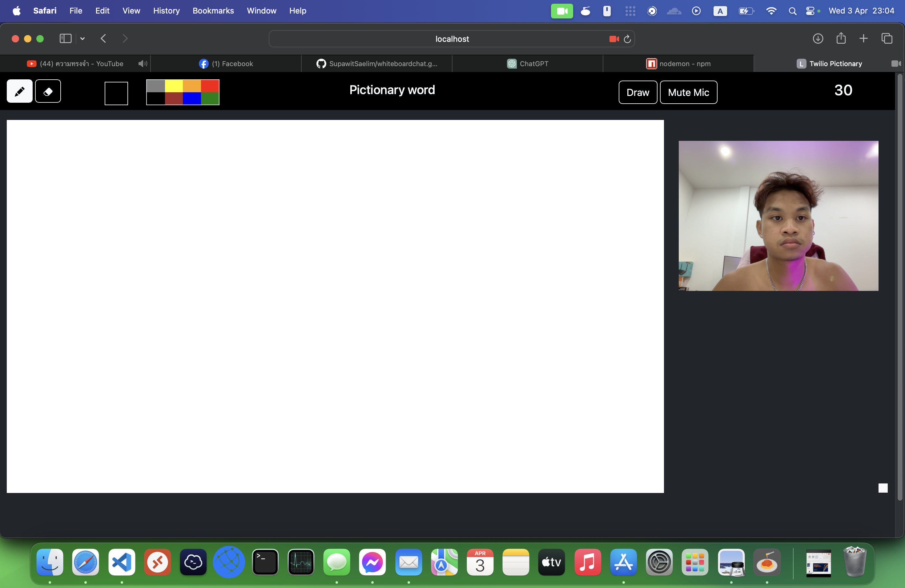
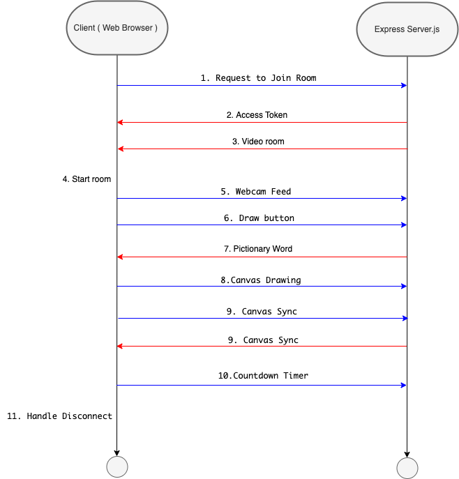

# Twilio Video Chat and Pictionary Game Server

This Node.js application serves as a backend for a video chat application using Twilio Video API and a Pictionary game. It provides endpoints for generating access tokens to join video rooms and obtaining Pictionary words.

## Features

- **Video Chat**: Allows users to join video rooms and engage in video conferencing using Twilio Video API.
- **Pictionary Game**: Provides random Pictionary words for players to guess.

## Requirements

- Node.js
- Twilio Account
- Twilio Video API Key
- Twilio Sync Service SID

## Setup

1. Install dependencies using `npm install`.
2. Create a `.env` file and set the following environment variables:

   ```
   TWILIO_ACCOUNT_SID=your_twilio_account_sid
   TWILIO_API_KEY_SID=your_twilio_api_key_sid
   TWILIO_API_KEY_SECRET=your_twilio_api_key_secret
   TWILIO_SYNC_SERVICE_SID=your_twilio_sync_service_sid
   ```

3. Start the server using `node app.js`.
4. Access the server at `http://localhost:3000`.

## Endpoints

- **POST /join-room**: Join a video room. Requires a JSON body with a `roomName` argument specifying the room name. Returns an access token.
- **GET /generate-pictionary-word**: Generate a random Pictionary word.

## Notes

- Ensure you have a Twilio account and the required API keys set up.
- Make sure to handle errors appropriately and implement security measures as needed.

Feel free to extend the functionality of this server to suit your application needs!





